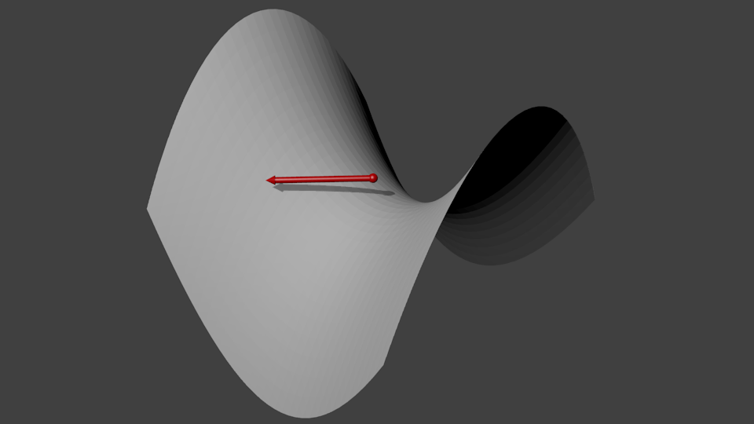
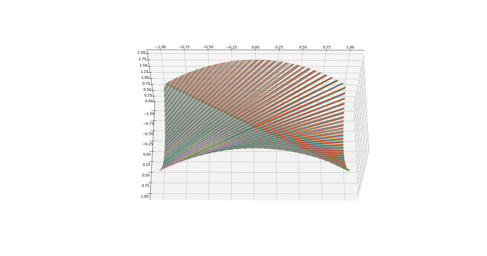
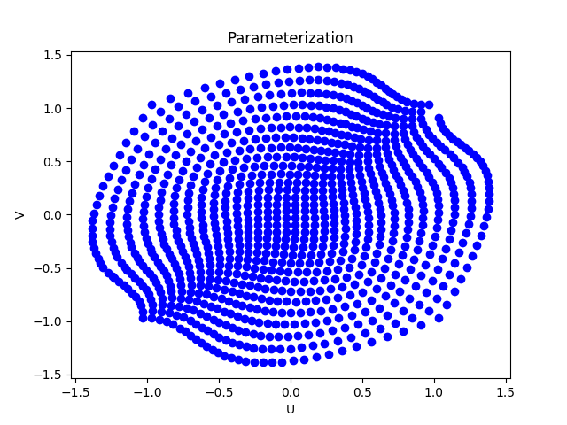
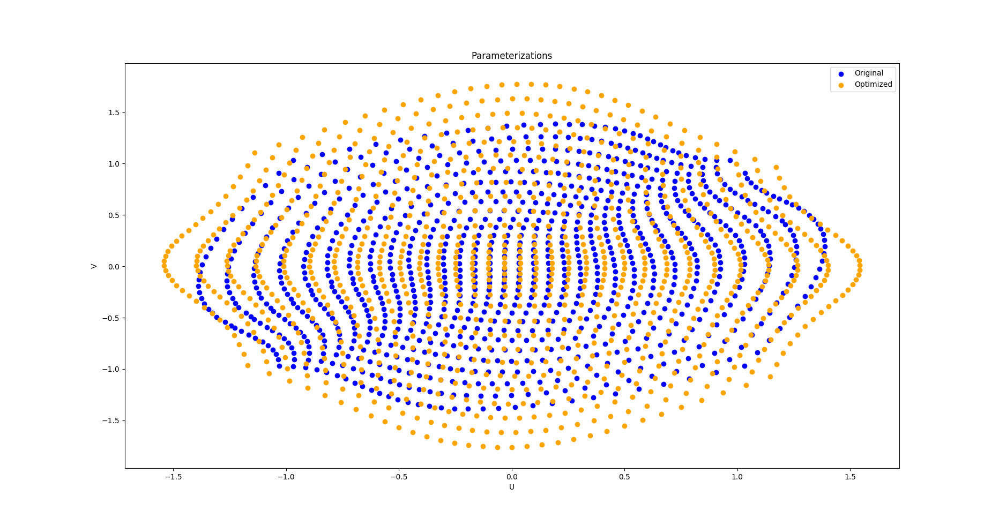

# Tutorial
This tutorial will follow one of the examples in [test.py](../test.py), specifically the optimization of fiber orientations on the 
saddle model. To run `test.py` simply run `python test.py` or launch `test.py` with `python launcher.py` which will launch
the `test.py` file in an IPython interactive shell with pylab already primed to be initialized.

Once Autofiber is installed correctly the package can be imported as follows:
```python
from autofiber.generator import AutoFiber as AF
```

In `test.py` the experiments are setup such that a variety of angles can be computed sequentially. To create an AutoFiber
object we can use the following call.
```python
# Saddle model - X3D - Anisotropic material properties
test = AF('demos/SmallSaddle32.x3d',
          np.array([0.0, 1.0, 0.0]),
          np.array([-np.cos(np.deg2rad(angle)), 0, -np.sin(np.deg2rad(angle))]),
          np.array([0, 1, 0]),
          materialproperties=materialproperties,
          fiberint=0.01,
          # Further angle to be applied to the given fiber direction
          #  This is typically used as a tolerance in the fiber angle but
          #  can be used to rotate the base parameterization such as in the case
          #  of the saddle part we can actually define a parameterization easily at 45.0 degrees.
          #  Recommended to be any number except exactly zero
          angle_error=45.0)
```

Here is a breakdown of each parameter used to create the AutoFiber object:
1. cadfile: Path to CAD file (currently supports x3d, stl, and De-La-Mo DMObjects)
2. initpoint: 3D point closest to the center of the surface we would like to work on
3. initdirection: 3D unit vector representing the fiber direction at initpoint
4. initnormal: 3D unit vector indicating the surface normal at initpoint (used to determine which surface to operate on)
5. materialproperties: Composite fiber material properties, if empty then a set of default properties will be used.
materialproperties is setup as follows: (E, poisson's ratio, G) if E is a list: for anisotropic [E1, E2, E3],
nu is [nu12, nu13, nu23], and the shear modulus G is [G12, G13, G23]. If E is not a list then an isotropic material
is used and G will be computed from E and nu.
6. fiberint: Perpendicular distance between generated geodesics
7. angle_error: Error incorporated into the initdirection, any error defined here is reversed during optimization
8. accel: Utilize OpenCL parallel geodesic generator (WIP - not currently functioning)

Therefore, if we have the following model:


We can pick the point which will be in approximately the center. The Autofiber package will determine the nearest vertex
to start from so we don't have to be extremely precise. It is not necessary to pick a start point in the center of the model,
however starting from this location will give us the greatest opportunity to cover the entire surface with geodesics.


Now, we need to figure out the direction of the geodesics we would like to use. Typically, if we consider a plane that goes
through the start point we picked that shares the same general surface normal as our model then we can determine a good
starting geodesic direction. Keep in mind that this direction will essentially set our U-V directions or in terms of
composite fibers the U direction is the longitudinal direction and V is the transverse direction. Therefore, more than not
we will use an initial geodesic direction in a principle direction i.e. [1, 0, 0] as seen here:


Occasionally, the algorithm will completely fail to create a parameterization and an error like the following might occur:
```python
Traceback (most recent call last):
  File "test.py", line 73, in <module>
    angle_error=0.1)
  File "/home/nate/research/autofiber/autofiber/generator.py", line 164, in __init__
    self.create_parameterization()
  File "/home/nate/research/autofiber/autofiber/generator.py", line 701, in create_parameterization
    assert np.where((np.isnan(self.geoparameterization).all(axis=1) & np.array(~mask)))[0].size == 0
AssertionError
```

If this happens, then the parameter `angle_error` might be of use. This parameter allows us to incorporate an error into
the angle the initial geodesic direction makes with the U direction on our starting plane we described earlier. This is
depicted in the following image:



Any error we create with the `angle_error` parameter will be reversed when we optimize the parameterization. For example,
when using the saddle model if we use an `angle_error=0.1`, which means we are basically using the define geodesic direction,
we will receive the above error. This is because the saddle and it's doubly curved nature makes it difficult to parameterize
the full surface. However, if we use an `angle_error=45.0` we can see that a full parameterization can be made. In most cases
this error should be ~0.1 or something close to zero (it's not recomended to use zero because geodesics can't be accurately
determined along mesh lines).

Once the geodesic direction vector has been determined and an appropriate `angle_error` applied then the surface normal,
typically that normal we used for the plane the geodesic direction vector is defined within can be calculated, usually
by just taking the cross product of the longitudinal and transverse directions. This is also the vector which the initial
geodesic direction vector will be rotated upon when the `angle_error` is applied.

If we have properly defined the AutoFiber object a parameterization will be created and the following output will be observed:
```python
Angle: 0.0
x3d_indexedfaceset_loader:  Non-implemented tag NavigationInfo
x3d_indexedfaceset_loader:  Non-implemented tag Background
x3d_indexedfaceset_loader:  Non-implemented tag PointLight
x3d_indexedfaceset_loader:  Non-implemented tag Viewpoint
Calculating parameterization...
[==================================================] 100%
Time to calculate geodesic parameterization: 12.801896 seconds
```

This will result in the following geodesics on our model:



as well as the following UV parameterization:



Now, this has created the necessary components to create optimized parameterizations for any fiber angle. To perform and
return an optimized parameterization we can use the following call:
```python
texcoords2inplane = test.layup(0.0, plotting=True)
```

`texcoords2inplane` is a matrix transformation that can be used to convert either 3D coordinates into the optimized fiber
parameterization or the other way around. We can optionally set `plotting=True` if we would also like to view the results.
Once this call is completed and an output like the following has been observed:
```python
Optimizing...
Initial strain energy: 111.22885079385848 J/(model length)
Residual: 4.048914335186282e-05       
Time to optimize: 14.077847 seconds
```
we can use this transformation to find out the fiber orientation at any point on our model. The Abaqus optimized
function included in the Autofiber package can be used to perform this operation. This function was designed to be used
within the Abaqus context but works perfectly well on its own as well. The saddle demo does not come with any predefined
list of interesting points we would like to look at so the default will be used, which is the centroids of each triangular
element. Since we set `plotting=True` in this case the fiber orientations at each element centroid was calculated and
can be observed in the following image:


The corresponding optimized parameterization can be seen below compared to the unoptimized starting parameterization. This
process can be thought of as follows, in typical deformation theory we would start from a reference state and solve for
the deformed state. However, in this scenario we are starting from the deformed state i.e. "inaccurate" geodesic defined space
and solving for the reference, undeformed or lowest energy state. Shown along with this image is a plot of the loss function
used to optimize the strain energy.




### Custom Points
To use the built in Abaqus function to find the fiber orientations at a list of custom locations on the model surface we
can use the following call:
```python
meshcoords = np.load("demos/curved_abaqus_mesh_coords.npy")
texcoords2inplane = test.layup(0.0, orientation_locations=meshcoords, plotting=True)
```

Where `meshcoords` is a saved list of three dimensional points lying on the surface of the model.

This is also demonstrated in the last demo in `test.py` titled "Curved Composite Mold / De-La-Mo - DMObject - Anisotropic material properties"