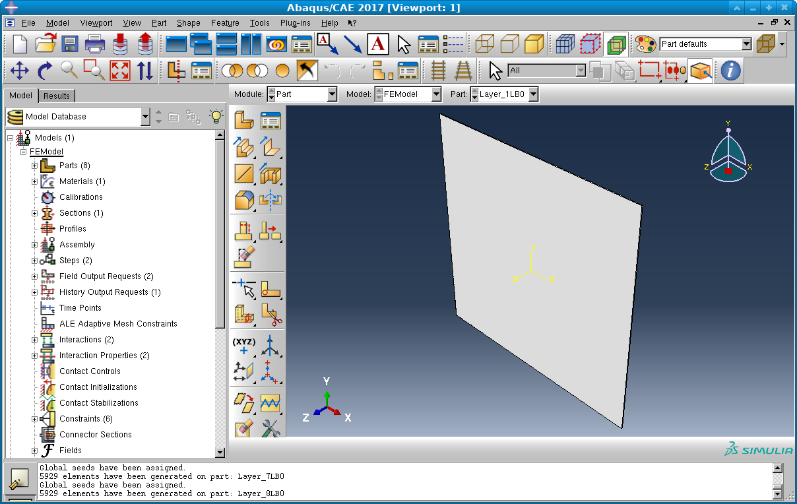
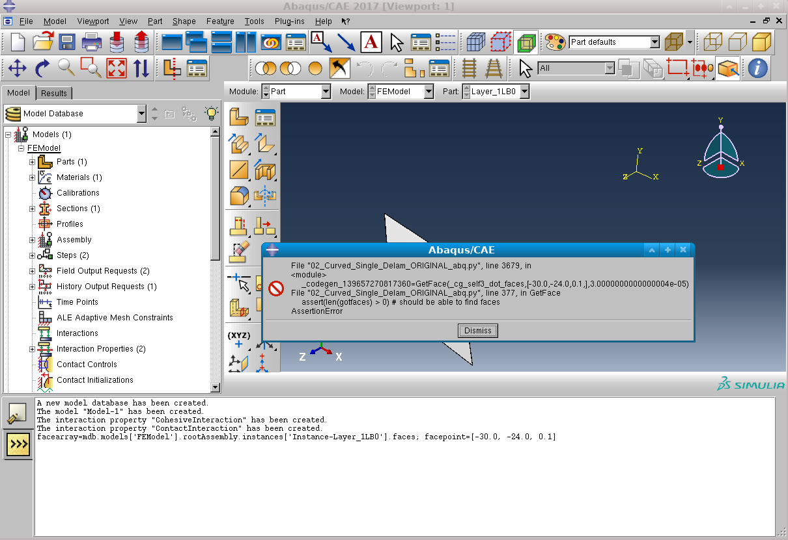

.. De-la-mo documentation master file, created by
   sphinx-quickstart on Mon Sep 17 07:01:23 2018.
   You can adapt this file completely to your liking, but it should at least
   contain the root `toctree` directive.

De-la-mo
========

.. toctree::
   :maxdepth: 2
   :caption: Contents:

   index
   delamo

Introduction
============
De-la-mo (De-Lamination-Modeler) is a system for constructing layer-by-layer finite element
models or sub-models of composite materials. It is designed
to be able to model curved surfaces as well as the presence of
delamination, fiber breakage, and/or matrix cracking. You build the
De-La-Mo model by specifying a set of manufacturing instructions --
creation of a mold, creation of a layer over that mold, creation of
additional layer(s), bonding of layers, meshing, etc. De-la-mo then
outputs a CAD model and script for creating the finite element model.

Requirements
============
De-la-mo is designed to work on Windows, Linux, and Macintosh given
the required dependencies.
* appdirs (Python library for identifying directory)
* rply (Python parser generator library)
* baron (Python abstract syntax tree library)
* redbaron (Python abstract syntax tree interface)
* numpy (Python numerical computation class library)
* pythonocc (3D CAD development framework built on the 3D CAD kernel `OCE project <https://github.com/tpaviot/oce/>`_)
* ABAQUS (Commercial finite element package)

The manufacturing instructions in De-la-mo take the form of a Python
script, so `Python <https://www.python.org>`_ 2.7 or newer is required.
In many cases you may want a more complete Python distribution such as
`Anaconda <https://www.anaconda.com>`_, Anaconda includes easily installable
prebuilt binaries of pythonocc which greatly simplifies the install process.

De-la-mo-v2 utilizes the `pythonocc framework <https://github.com/tpaviot/pythonocc-core>`_
to perform all of its geometric operations. Prebuilt binaries for Windows, Linux,
and Mac for Python versions greater than 2.7 are available on Anaconda
and can be installed with the following command::

   conda install -c conda-forge -c dlr-sc -c pythonocc -c oce pythonocc-core==0.18.1 python=3.5

Replace "3.5" with your desired Python version number such as "2.7" or "3.6" in the previous
command.

De-la-mo depends on the `numpy <https://www.numpy.org>`_ numerical
python library and the `baron <https://github.com/PyCQA/baron>`_ and
`redbaron <https://github.com/PyCQA/redbaron>`_ packages for dynamic
modification and conversion of scripts. Numpy is included with
Anaconda and most Linux distributions. It can also be installed
with pip::

  pip install numpy

De-la-mo will partially work work without baron and redbaron, but they
are required if you are going to use delamo_process or multi-step
processes.
To install baron and redbaron, install first the preqrequisites
`appdirs <https://github.com/ActiveState/appdirs>`_ and `rply <https://github.com/alex/rply>`_ for example either with Anaconda::

  conda install -c anaconda appdirs
  conda install -c conda-forge rply
  
Or you could install them with pip::

  pip install appdirs
  pip install rply

To install baron and redbaron, clone the git repositories (or download .zip
files). For the moment redbaron requires some bugfix/improvement patches
for full compatibility with De-la-mo, so use our version at `https://github.com/sdh4/redbaron/ <https://github.com/sdh4/redbaron/>`_ and run from a
shell (such as an Anaconda shell) configured for your desired Python environment)::
  
  git clone https://github.com/PyCQA/baron.git
  cd baron
  python setup.py build
  python setup.py install
  
  git clone https://github.com/sdh4/redbaron.git
  cd redbaron
  python setup.py build
  python setup.py install

De-la-mo requires the `ABAQUS <https://www.3ds.com/products-services/simulia/products/abaqus/>`_ finite element package. You should make sure the  'abaqus.bat' (Windows) or 'abaqus' (Other platforms) script is available in your command path.
This documentation will presume some familiarity with ABAQUS, Python, and
Python scripting in ABAQUS. If any of this will be new to you, we highly
recommend the book `"Python Scripts for ABAQUS: Learn by Example" by
Gautam M. Puri <http://www.abaquspython.com>`_

Installation
============

Be sure the prerequisite components (listed under Requirements, above)
are installed. Download or clone the `De-la-mo-v2 <https://git.linux.iastate.edu/NASA-AK/de-la-mo-v2>`_ source tree. Then
execute the following in the root directory of the de-la-mo source tree::

   git clone --recursive https://git.linux.iastate.edu/NASA-AK/de-la-mo-v2
   cd de-la-mo-v2/
   python setup.py build
   python setup.py install

Running De-la-mo
================
De-la-mo comes with a series of example scripts. While executing the
example scripts directly from Python will perform basic building of
a generated CAD model and ABAQUS script, we generally recommend you
run the examples using the "delamo_process" program.

On Linux/Macintosh you can usually run delamo_process directly from
a terminal, and
the installation will place it into your path, such as into
/opt/bin or /usr/local/bin e.g.::

  cd examples/
  delamo_process 01_Planar_Single_Delam.py

On Windows you may need to explicitly call the python interpreter from
a command prompt::

  python c:\delamo\scripts\delamo_process c:\delamo\examples\01_Planar_Single_Delam.py

The delamo_process program will list the processing steps used by your
specified example script, and give you the option to execute
those steps, for example::
  
  Process = None
  
  Process phases             GEN                BUILDMODEL
  -----------------------------------------------------------------
   1:     ORIGINAL  2018/09/18 01:57:44               MISSING
  -----------------------------------------------------------------

   Commands are: GEN <phase>  (Generate builder script)
                 BM <phase>  (Run builder script to build model)
                 BMINTERACT <phase>  (Run builder script interactively)
                 FEBATCH <phase> (Execute finite element script; script must
                                 run its job to be useful) 
                 FEINTERACT <phase> (Execute finite element script interactively)
                 QUIT
  
   Enter command --> 
  
The "GEN" command generates a De-la-mo script (not applicable in this case).
The "BM" (build model) command runs the De-la-mo script to generate
a CAD model and ABAQUS script. The "FEINTERACT" (interactive finite element)
command interatively starts the generated CAD model and ABAQUS script
in ABAQUS.

To test your De-la-mo installation, type "BM 1" and press <ENTER>.
If your De-la-mo installation is working properly, you should see output
similar to the following::
  
  /usr/bin/python 01_Planar_Single_Delam.py
  Face adjacency: Layer Layer_1 and Layer Layer_2:
      Tie, Body Layer_1LB0 to Layer_2LB0
  Face adjacency: Layer Layer_2 and Layer Layer_3:
      Contact, Body Layer_2LB0 to Layer_3LB0
      Nomodel, Body Layer_2LB0 to Layer_3LB0
      Cohesive, Body Layer_2LB0 to Layer_3LB0
  Face adjacency: Layer Layer_3 and Layer Layer_4:
      Tie, Body Layer_3LB0 to Layer_4LB0
  Face adjacency: Layer Layer_4 and Layer Layer_5:
      Tie, Body Layer_4LB0 to Layer_5LB0
  Face adjacency: Layer Layer_5 and Layer Layer_6:
      Tie, Body Layer_5LB0 to Layer_6LB0
  Face adjacency: Layer Layer_6 and Layer Layer_7:
      Tie, Body Layer_6LB0 to Layer_7LB0
  Face adjacency: Layer Layer_7 and Layer Layer_8:
      Tie, Body Layer_7LB0 to Layer_8LB0
  Added Layer_1LB0 to the save list.
  Added Layer_2LB0 to the save list.
  Added Layer_3LB0 to the save list.
  Added Layer_4LB0 to the save list.
  Added Layer_5LB0 to the save list.
  Added Layer_6LB0 to the save list.
  Added Layer_7LB0 to the save list.
  Added Layer_8LB0 to the save list.
  Saved 8 bodies.
  SUCCESS: Saved SAT file!

If the output you see contains error messages or is not similar to the above, troubleshoot the errors. The most likely problems are:
* Wrong Python version or Python installation being used
* Missing prerequisite libraries
See the troubleshooting section below for more help. You can also
try running the De-la-mo script directly with your Python interpreter.

If the build model step ran successfully, then it will have
created an output directory 01_Planar_Single_Delam_output/
containing an ABAQUS script 01_Planar_Single_Delam_ORIGINAL_abq.py and
a CAD model 01_Planar_Single_Delam_ORIGINAL.sat

The "FEINTERACT 1" command within delamo_process will run ABAQUS/CAE on
this script and CAD model. Alternatively you can run the script from the
ABAQUS/CAE graphical user interface.

The script will automatically load the CAD model, apply the various
boundary conditions specified in the script, and mesh the model per
the instructions in the script. When complete, 
it should be ready
for you to initiate the finite element analysis. 

   Figure 1: Screenshot of CAD model loaded into ABAQUS.

Figure 1 shows a screenshot of the example loaded into ABAQUS.
You can browse through
the various ABAQUS parts, representing layers or layer fragments,
and the corresponding instances in the assembly. You can
also see the configured section (specified in abqparams_CFRP.py).
You can see the interactions representing cohesive and contact models
for delaminated layers. Under "Constraints" there are the TIE boundary
conditions between other layers. The configured force loading is under
"Loads" and the fixed faces are under "BC's".

To execute the finite element analysis, open up "Jobs", find the
created job ("BendingJob" in this case), right click and submit.
You should be able to watch its status with the "monitor" option,
then when complete view the output in the output database under
the "Results" tab just like any other ABAQUS analysis. 

Tutorial
========
This tutorial assumes that De-la-mo is correctly installed and
operational, and that you have practiced the "Running De-la-mo"
instructions listed above. It will walk you through
the creation of a simple layer-by-layer model.
This tutorial follows the example 01_Curved_Single_Delam.py.

Your De-la-mo script generally starts with a series of Python
import statements that provide access to the Delamo libraries and
routines and to basic components of Numpy and the Python standard
library::

   import numpy as np

   from delamo.api import DelamoModeler
   from delamo.api import Layer
   from delamo.api import bond_layers
   from delamo.api import SimpleCoordSys
   from delamo import process
   from delamo.layer import LayerMold

   import os

Then usually you initialize the delamo modeler::

   # Initialize the DeLaMo model
   DM=DelamoModeler.Initialize(globals(),
                               pointtolerancefactor=100.0,
                               normaltolerance=100e-4)

De-la-mo is designed to facilitate automated multi-step processes that include
steps such as creation of an original model, insertion of damage, etc.
The next step in the De-la-mo script is to figure out where the generated
ABAQUS script and generated CAD file should be saved. This is done by calling
the process.output_filenames() function::

  (script_to_generate,
   cad_file_path_from_script,
   layer_boundary_template) = process.output_filenames("01_Curved_Single_Delam",phase="ORIGINAL")

The first parameter to process.output_filenames() is the base name of
the containing script (i.e. with the .py removed). This allows the
generated ABAQUS script and CAD file to be named according to the
De-la-mo script. (If you copy or
rename the script you will need to change the first parameter.)

You also need to give process.output_filenames() a keyword parameter
specifiying the phase, which should always be "ORIGINAL". You may also
give it an optional parameter "process" to specify a multi-step process
for inclusion and integration of modeled damage. This parameter may be
None, indicating a simple one-step process, or "DEFECT_INSERTION" which
enables a 4 step process ("ORIGINAL", "PREDAMAGE", "APPLY_DAMAGE", and "DAMAGED"). For the DEFECT_INSERTION process you can provide an additional keyword parameter "apply_damage_script" which specifies a Python script to run for the
"APPLY_DAMAGE" phase.

process.output_filenames() returns a tuple of three values:
(script_to_generate,cad_file_path_from_script,layer_boundary_template) --
the name of the ABAQUS script to generate, the relative path to the CAD
file from the script to generate, and a filename template used for
exporting layer boundary meshes.

Once you have determined the output filenames, the only other thing
needed for  De-La-Mo to generate a model that can go into ABAQUS
will be a line at the very end of your script::

  # Finalization generates the output script and CAD model.
  # THIS MUST BE THE LAST LINE IN THE SCRIPT!
  DM.Finalize(script_to_generate,cad_file_path_from_script)

This line actually writes out the generated script and CAD file. 

After the output_filenames() call, the next step in your De-la-mo script is to insert one or more ABAQUS
initialization scripts::

  DM.abaqus_init_script("abqparams_CFRP.py",globals())

The DM.abaqus_init_script() call causes the specified ABAQUS
Python initialization to be inserted in the generated ABAQUS script.
Variables assigned in the initialization script will be accessible
as proxies :ref:`proxies`. At minimum, the initialization script needs
to assign the variable FEModel to the primary model (entry in abq.mdb.models),
and assign LaminateAssembly to the rootAssembly attribute of FEModel.
Usually your initialization script will also specify material properties,
define cohesive and contact interaction models, and define sections, steps,
field output requests, lists of allowable mesh element types, and/or a
runnable job.

The necessary Python configuration can be identified by doing the
relevant setup using the ABAQUS/CAE interface and then looking at the
generated replay (abaqus.rpy) text file. For example,
if you run ABAQUS/CAE, then create a material and section, and look in
the abaqus.rpy file you will find something similar to
(below boilerplate at the top)::
  
  Mdb()
  #: A new model database has been created.
  #: The model "Model-1" has been created.
  session.viewports['Viewport: 1'].setValues(displayedObject=None)
  session.viewports['Viewport: 1'].partDisplay.setValues(sectionAssignments=ON, 
      engineeringFeatures=ON)
  session.viewports['Viewport: 1'].partDisplay.geometryOptions.setValues(
      referenceRepresentation=OFF)
  mdb.models['Model-1'].Material(name='Composite material')
  mdb.models['Model-1'].materials['Composite material'].Elastic(type=LAMINA, 
      table=((141500.0, 8500.0, 0.33, 5020.0, 5020.0, 2350.0), ))
  sectionLayer1 = section.SectionLayer(material='Composite material', 
      thickness=0.2, orientAngle=0.0, numIntPts=1, plyName='zero')
  sectionLayer2 = section.SectionLayer(material='Composite material', 
      thickness=0.2, orientAngle=90.0, numIntPts=1, plyName='ninety')
  mdb.models['Model-1'].CompositeSolidSection(name='Section-1', 
  layupName='zero ninety', symmetric=False, layup=(sectionLayer1, 
      sectionLayer2, ))

Many of the lines in the replay file are irrelevant. The Mdb() line
clears the model database. All of the session.viewports lines
affect what is being looked at, as opposed to the underlying model.
The significant lines here are the lines which begin::

  mdb.models['Model-1'].

In De-la-mo, we use the variable FEModel (as defined in abqparams_CFRP.py)
as a substitute for the entry in mdb.models[...]. With this
substitution and the removal of irrelevant lines, the replay entries
reduce to::

  FEModel.Material(name='Composite material')
  FEModel.materials['Composite material'].Elastic(type=LAMINA, 
      table=((141500.0, 8500.0, 0.33, 5020.0, 5020.0, 2350.0), ))
  sectionLayer1 = section.SectionLayer(material='Composite material', 
      thickness=0.2, orientAngle=0.0, numIntPts=1, plyName='zero')
  sectionLayer2 = section.SectionLayer(material='Composite material', 
      thickness=0.2, orientAngle=90.0, numIntPts=1, plyName='ninety')
  FEModels.CompositeSolidSection(name='Section-1', 
  layupName='zero ninety', symmetric=False, layup=(sectionLayer1, 
      sectionLayer2, ))

This can then be manually cleaned up and organized. The
FEModel.materials['Composite material'] can be replaced with
a variable assigned to the result from FEModel.Material().
Variables can be manually renamed. 
Also, in De-la-mo symbolic constants such as LAMINA need to be
replaced with attributes of abqC, e.g. abqC.LAMINA::

  CompositeMaterial = FEModel.Material(name='Composite material')
  CompositeMaterial.Elastic(type=LAMINA, 
      table=((141500.0, # E1
              8500.0, # E2
	      0.33,  # Nu12
	      5020.0, # G12
	      5020.0, # G13
	      2350.0), )) # G23
	      
  CompositeSectionLayer1 = section.SectionLayer(material='Composite material', 
      thickness=0.2, orientAngle=0.0, numIntPts=1, plyName='zero')
  CompositeSectionLayer2 = section.SectionLayer(material='Composite material', 
      thickness=0.2, orientAngle=90.0, numIntPts=1, plyName='ninety')
  
  CompositeSection = FEModels.CompositeSolidSection(name='CompositeSection', 
      layupName='zero ninety', symmetric=False, layup=(CompositeSectionLayer1, 
      CompositeSectionLayer2, ))
  
Cleaned-up text like this can then be pasted into an initialization file (such as abqparams_CFRP.py)
or into the De-la-mo script. We won't use it in this example, but we could!

Calls to ABAQUS functions and methods aren't executed when your De-la-mo script executes; they can't be because
ABAQUS isn't running yet! Instead, De-la-mo queues them up and inserts them into the generated
ABAQUS script. The fact that these functions don't get called until later (when ABAQUS executes) is mostly transparent.
You generally can use such functions as normal. They are implemented as proxy objects that record their operations that,
when called, return new proxy objects. The fact that these calls are not made until later does have a few side effects: 
* It will not work to pass these objects to functions that need to interrogate them NOW. It is OK so long as they end up getting passed eventually to ABAQUS (which is usually the case), but it is not possible for the output to be extracted or to make a flow control decision (such as an if statement or the number of iterations in a for loop) based on their value.
* The calls to these functions and methods are classified based on the origin of the proxy objects into initialization calls, assembly calls, boundary condition calls, mesh calls, fiber calls, and run calls. All initialization calls are executed first, then assembly calls, then boundary condition calls, then mesh calls, then fiber calls, and finally run calls. As a result the order of execution in the generate ABAQUS script may be different from the order of execution in the De-la-mo script. This is beneficial because it helps ensure that the internal solid model inside ABAQUS is complete and assembled before boundary conditions or meshing  -- which may be dependent on the assembly -- are started.

You can insert a line such as::

  LaminateAssemblyMeshing=DM.meshinstrs.rewrapobj(LaminateAssembly)

to take an existing variable (in this case LaminateAssembly, which is specified in
abqparams_CFRP.py) and create a new proxy object that reclassifies operations into a
different class of calls. In this case LaminateAssemblyMeshing will work just like
LaminateAssembly, except that method calls on LaminateAssemblyMeshing will be executed
among the meshing calls phase instead of among initialization calls (because LaminateAssembly
was defined in the initialization script). 

Continuing our tutorial, we assign a variable representing how thick we will make the layers::

  # Set layer thickness
  thickness = 0.199

Next we define a coordinate system. This coordinate system matches the default (the same
coordinate system you would get if you failed to specify one). The coordinate system is
defined by two points, one along the first axis from the origin, one along the second
axis (which should be normal). The third axis is defined from the cross product::

  coordsys=SimpleCoordSys((1.0,0.0,0.0),(0.0,1.0,0.0)) 

Material (i.e. fiber) directions will be specified relative to this coordinate system.
In the current version of De-la-mo this coordinate system is the same everywhere within
your De-la-mo model. De-la-mo contains functions that will utilize the fiber layup strategies
employed by the `autofiber <https://github.com/nscheirer/autofiberlib>`_ library. This library is included in the de-la-mo package but
specific details on the method and a standalone package can be observed `here <https://github.com/nscheirer/autofiber>`_. De-la-mo
will operate perfectly well without the AutoFiber library fiber layup methods but the fiber
orientations defined by the coordsys is regarded as less accurate in certain curved model cases,
especially doubly-curved surfaces. See example "05_Curved_Single_Delam_AutoFiber" to see how to incorporate
the AutoFiber orientations in the tutorial we are going through right now.

Use a CAD package such as SolidWorks or Catia to create a mold surface.
For example, the Mold surface can be created in SolidWorks using the freeform editor tool. You can first create a flat surface by extruding a line and make use of the freeform feature to change the shape of the surface. The following `tuturial <https://grabcad.com/tutorials/tutorial-for-beginners-how-to-free-form-surface-in-solidworks>`_ provides a detailed example of creating a free form surface in SolidWorks.
Save the mold in ACIS (".sat") format. The mold can then be loaded into De-la-mo as follows::

   # Load a NURBS mold surface from a file
   Mold = LayerMold.FromFile(os.path.join("..","data","CurvedMold1.STEP"))

Then you can create a De-la-mo layer from the mold by specifying the mold variable in the second
parameter to CreateFromMold()::

   layer1 = Layer.CreateFromMold(DM,Mold,"OFFSET",thickness,"Layer_1",LaminaSection,0,coordsys=coordsys)

This function performs an offsetting operation (similar to extrusion) of the specified thickness.
It creates a De-la-mo layer object that wraps both an underlying geometry object and an underlying ABAQUS object.
It applies the specified ABAQUS section (LaminaSection in this case) to the newly created layer.
The third parameter must either be delamo.CADwrap.OFFSET_DIRECTION or delamo.CADwrap.ORIG_DIRECTION, which determines
which the direction of the offsetting (the easiest way to pick the direction is to try an extrusion with a large amount of thickness
and see if it extruded the wrong way). 

Once you are done creating a layer, including any operations -- such as advanced fiber layup with AutoFiber, inclusion of fiber breakage, or matrix cracking that might
split the layer into multiple pieces -- you must finalize the layer::

  layer1.Finalize(DM)

Once finalized, the layer can be meshed::

  layer1.MeshSimple(MeshElemTypes,meshsize,abqC.HEX_DOMINATED,abqC.SYSTEM_ASSIGN)

This call refers back to the set of mesh element types (MeshElemTypes) specified in abqparams_CFRP.py
and the meshsize variable also specified there. The third and fourth parameters are the elemShape
and elemTechnique values to be passed to the ABAQUS setMeshControls() method.
Note that the symbolic constants HEX_DOMINATED and SYSTEM_ASSIGN have to be
accessed from abqC, the module of ABAQUS constants.

Typically you will want to do some kind of structural test of the
layer-by-layer finite element model created by De-la-mo. The structural
test requires setting up some kind of external boundary condition. 
In this example we will show how to create a fixed (encastre)
boundary condition on one edge, then apply a traction to a surface.

The Python code to define a desired boundary condition can be identified
using the replay file (abaqus.rpy) using the same techniques illustrated
in the material and section example, above. In this case we create a
fixed boundary condition by calling the
EncastreBC method of the ABAQUS object FEModel::

   FixedPoint=[-40.0,-50.0,0.1]
   FEModel.EncastreBC(name="FixedFace_%d" % (DM.get_unique()),
                      createStepName=ApplyForceStep.name,
                      region=layer1.singlepart.GetInstanceFaceRegion(FixedPoint,0.07))

In the above example, a unique name is guaranteed by appending a
unique number from DM.get_unique(). The region (surface) to which the boundary
condition is applied is identified by coordinates by using the GetInstanceFaceRegion method of the De-la-mo "part" object. This method looks for a face within the given tolerance distance of the specified point coordinates. If you used
your own CAD model for the mold, you will almost certainly need to find
your own coordinates for an edge of the first layer. 

Coordinates can be identified in the ABAQUS/CAE graphical user interface by using the Point/Node query, within the "Query..." tool of ABAQUS "Tools" menu. If the point cannot be found when running the generated ABAQUS script, you will get an AssertionError marked as "should be able to find faces". For more help, look under Troubleshooting, below.

Be sure not to use coordinates of an edge point or corner point of the face.
If you do, it may not uniquely identify a face. One trick is to query
several nodes and interpolate between them. 

The first layer has now been completely set up. We can now create the
second layer similar to how we created the first with the CreateFromMold() function, and we will use a different layup orientation of -45 degrees::

   # Create 2nd layer
   layer2 = Layer.CreateFromMold(DM,layer1.gk_layer.OffsetMold(),"OFFSET",thickness,"Layer_2", LaminaSection,-45,coordsys=coordsys)
   layer2.Finalize(DM)
   layer2.MeshSimple(MeshElemTypes,meshsize/1.8,abqC.HEX_DOMINATED,abqC.SYSTEM_ASSIGN)

Now that we have two layers, we can bond them together. This bonding
call uses a tie (continuity boundary condition)::

  # Bond the layers together
  bond_layers(DM,layer1, layer2)

We also need to apply a fixed boundary condition to the edge of this layer,
but at a z value increased by the thickness::

   # Update and add point marker for fixed faced boundary condition
   FixedPoint[2]+=thickness
   FEModel.EncastreBC(name="FixedFace_%d" % (DM.get_unique()),
                      createStepName=ApplyForceStep.name,
                      region=layer2.singlepart.GetInstanceFaceRegion(FixedPoint,0.07))

Now we can create a third layer, this time at +45 degree orientation::

   # Create 3rd layer
   layer3 = Layer.CreateFromMold(DM,layer2.gk_layer.OffsetMold(),"OFFSET",thickness,"Layer_3",LaminaSection,45,coordsys=coordsys)
   layer3.Finalize(DM)
   layer3.MeshSimple(MeshElemTypes,meshsize/1.8,abqC.HEX_DOMINATED,abqC.SYSTEM_ASSIGN)

This time, let us bond but with a delamination. We will specify
defaultBC to be delamo.CADwrap.BC_COHESIVE, which overrides the
surrounding to use a cohesive boundary condition. As a result we also
need to specify the ABAQUS interaction properties for the surrounding
area (CohesiveInteraction) and the delaminated zone
(ContactInteraction). In addition a small ring around the delamination
is left with no boundary condition to help with convergence. The
coordinates of the delamination outline are extracted from the
specified .csv file and projected onto the boundary::

   bond_layers(DM,layer2, layer3, defaultBC="COHESIVE",
               CohesiveInteraction=CohesiveInteraction,
               ContactInteraction=ContactInteraction,
               delaminationlist= [ "../data/nasa-delam12-2.csv" ])

As before, the 3rd layer needs its edge boundary condition::

   FixedPoint[2]+=thickness
   FEModel.EncastreBC(name="FixedFace_%d" % (DM.get_unique()),
                      createStepName=ApplyForceStep.name,
                      region=layer3.singlepart.GetInstanceFaceRegion(FixedPoint,0.07))

We can then create layers 4-8 similarly::

   # Create 4th layer
   layer4 = Layer.CreateFromMold(DM,layer3.gk_layer.OffsetMold(),"OFFSET",thickness,"Layer_4",LaminaSection,90,coordsys=coordsys)
   layer4.Finalize(DM)
   layer4.MeshSimple(MeshElemTypes,meshsize/2.0,abqC.HEX_DOMINATED,abqC.SYSTEM_ASSIGN)

   bond_layers(DM,layer3, layer4)

   # Update and add point marker for fixed faced boundary condition
   FixedPoint[2]+=thickness
   FEModel.EncastreBC(name="FixedFace_%d" % (DM.get_unique()),
                      createStepName=ApplyForceStep.name,
                      region=layer4.singlepart.GetInstanceFaceRegion(FixedPoint,0.07))

   # Create 5th layer over the layer 4 or the stiffener contour, if present
   # ... for we just tell it to follow the layer 4 contour, which
   # the stiffener automagically expanded
   layer5 = Layer.CreateFromMold(DM,layer4.gk_layer.OffsetMold(),"OFFSET",thickness,"Layer_5",LaminaSection,90,coordsys=coordsys)
   layer5.Finalize(DM)
   layer5.MeshSimple(MeshElemTypes,meshsize/2.0,abqC.HEX_DOMINATED,abqC.SYSTEM_ASSIGN)

   bond_layers(DM,layer4, layer5)

   # Update and add point marker for fixed faced boundary condition
   FixedPoint[2]+=thickness
   FixedPoint[1]-=.07 # accommodate outward shift as we go up
   FEModel.EncastreBC(name="FixedFace_%d" % (DM.get_unique()),
                      createStepName=ApplyForceStep.name,
                      region=layer5.singlepart.GetInstanceFaceRegion(FixedPoint,0.07))

   # Create 6th layer
   layer6 = Layer.CreateFromMold(DM,layer5.gk_layer.OffsetMold(),"OFFSET",thickness,"Layer_6",LaminaSection,45,coordsys=coordsys)
   layer6.Finalize(DM)
   layer6.MeshSimple(MeshElemTypes,meshsize/2.0,abqC.HEX_DOMINATED,abqC.SYSTEM_ASSIGN)

   bond_layers(DM,layer5, layer6)

   # Update and add point marker for fixed faced boundary condition
   FixedPoint[2]+=thickness
   FEModel.EncastreBC(name="FixedFace_%d" % (DM.get_unique()),
                      createStepName=ApplyForceStep.name,
                      region=layer6.singlepart.GetInstanceFaceRegion(FixedPoint,0.07))

   # Create 7th layer
   layer7 = Layer.CreateFromMold(DM,layer6.gk_layer.OffsetMold(),"OFFSET",thickness,"Layer_7",LaminaSection,-45,coordsys=coordsys)
   layer7.Finalize(DM)
   layer7.MeshSimple(MeshElemTypes,meshsize/2.0,abqC.HEX_DOMINATED,abqC.SYSTEM_ASSIGN)

   bond_layers(DM,layer6, layer7)

   # Update and add point marker for fixed faced boundary condition
   FixedPoint[2]+=thickness
   FEModel.EncastreBC(name="FixedFace_%d" % (DM.get_unique()),
                      createStepName=ApplyForceStep.name,
                      region=layer7.singlepart.GetInstanceFaceRegion(FixedPoint,0.07))

   # Create 8th layer
   layer8 = Layer.CreateFromMold(DM,layer7.gk_layer.OffsetMold(),"OFFSET",thickness,"Layer_8",LaminaSection,0,coordsys=coordsys)
   layer8.Finalize(DM)
   layer8.MeshSimple(MeshElemTypes,meshsize/2.0,abqC.HEX_DOMINATED,abqC.SYSTEM_ASSIGN)

   bond_layers(DM,layer7, layer8)

   # Update and add point marker for fixed faced boundary condition
   FixedPoint[2]+=thickness
   FEModel.EncastreBC(name="FixedFace_%d" % (DM.get_unique()),
                      createStepName=ApplyForceStep.name,
                      region=layer8.singlepart.GetInstanceFaceRegion(FixedPoint,0.07))
  
Now we've created the entire model. Let's add a selectable surface
that can be identified from ABAQUS/CAE::

  # Can define a "Surface" that is visible in the Abaqus output database
  # This is a direct ABAQUS call on the part object
  # within layer1 (assumes layer1 is not split due to fiber/matrix breakage)
   layer1.singlepart.fe_part.Surface(name="ForceSurface",
                                     side1Faces=layer1.singlepart.GetPartFace((-49.0,-49.0,thickness*0),0.1))

We also need to apply a load for the structural test,
in this case a surface traction::

   ForceVector=[ 0.0, 0.0, -2e-2 ] # Units of MPa

   # Call ABAQUS SurfaceTraction method
   # Again, this came from looking at ABAQUS replay (.rpy) output
   # Observe again that all ABAQUS symbolic constants need the "abqC"
   # prefix.
   FEModel.SurfaceTraction(name="SurfaceTraction_%d" % (DM.get_unique()),
                           createStepName=ApplyForceStep.name,
                           region=layer1.singlepart.GetInstanceFaceRegionSurface((-49.0,-49.0,thickness*0.0),0.1),
                           distributionType=abqC.UNIFORM,
                           field='',
                           localCsys=None,
                           traction=abqC.GENERAL,
                           follower=abqC.OFF,
                           resultant=abqC.ON,
                           magnitude=np.linalg.norm(ForceVector),
                           directionVector=((0.0,0.0,0.0),tuple(ForceVector/np.linalg.norm(ForceVector))),
                           amplitude=abqC.UNSET)

And finally, the last line of the script must be the finalization
which writes out the generated script and CAD file::

  DM.Finalize(script_to_generate,cad_file_path_from_script)

That's all there is to it!!!			  

Automated damage insertion and multi-step processes
===================================================
De-la-mo is designed to facilitate automatic insertion of
measured damage based on nondestructive evaluation
data. See examples/07_ComputedTomography_Damage.py
for an example.

Inserting measured damage is inherently a multi-step
process: You have to have already built a model
in order to know where the layer boundaries are, so
you can correctly apply the damage to the layer boundaries.
De-la-mo has builtin support for multi-step modules
through the delamo_process utility script and the
process.output_filenames() function in your De-la-mo script.

You enable multi-step process support by adding
the keyword parameter "process=" to the call to
process.output_filenames() in your De-la-mo script.
Currently there is only one such process supported
by De-la-mo, called "DEFECT_INSERTION" and defined
near the top of the delamo.process Python module. 

In the defect insertion process, you write an 'ORIGINAL'
script that defines the structure, but not the damage.
The ORIGINAL script is preprocessed into a PREDAMAGE script,
unwrapping any loops so that layer bonding operations
can be uniquely identified. 

Usually you will need
to know the geometry of the layer boundaries, so that delaminations
can be inserted between the appropriate layers.
The PREDAMAGE step generates layer boundary geometry in the form of
.stl files in the _output/ directory, as well as a full CAD and
finite element model of the undamaged composite. It also clears out
any pre-existing delamination outlines. 

Presumably you have some process to determine delamination outlines.
The delamination outlines need to be specified in the counterclockwise direction 
when you look at the offset surface of the mold. In addition the first and the last point
of the delamination outline need to be the same to get a closed profile.
The purpose of the APPLY_DAMAGE step is to run your script to determine
those outlines. The name of your script for generating the damage outlines
can be passed as a "apply_damage_script=" keyword parameter to
process.output_filenames(). The PREDAMAGE step will have generated the
.sat CAD model and a series of .stl layer boundaries. Each layer boundary
is named layerboundary_PREDAMAGE_yyyyy.stl where yyyyy is a positive
integer that uniquely identifies the boundary (it happens to correspond
to the line number of the call to bond_layers() in the PREDAMAGE script).
Your script for generating delamination outlines needs to generate .csv
files with the outlines of delaminations. The files should be named
layerdelam_yyyyy_index.csv, where "yyyyy" identifies the delaminated boundary
and "index" is an arbitrary index unique within that boundary.

The final step is the "DAMAGED" step which generates the damaged version of
the CAD model and the corresponding ABAQUS script to generate the damaged
version of the finite element model. 

These multi-step processes are most easily run using the delamo_process
utility script. The GEN command in delamo_process will generate the
De-la-mo script for that step (except for the ORIGINAL script, which
is manually written, and for the APPLY_DAMAGE step, where the GEN
command runs the user-written damage script).
The BM command in delamo_process builds the CAD model and ABAQUS
script for the given step. Then the FEINTERACT command in delamo_process
runs the ABAQUS script to generate the finite-element model.

For the example included as examples/07_ComputedTomography_Damage.py,
the steps are:
1. (Optional) BM ORIGINAL then FEINTERACT ORIGINAL if you want to test out the original manually created script, without defects.
2. GEN PREDAMAGE to generate the PREDAMAGE De-la-mo script from the manually written ORIGINAL script.
3. BM PREDAMAGE to generate the pre-damage CAD model, layer boundary .stl files, and predamage finite element ABAQUS script.
4. (Optional) FEINTERACT PREDAMAGE to perform finite element on the undamaged model
5. GEN APPLY_DAMAGE to run the user-written damage script that adds delamination outline .csv files to the _output/ directory.
6. GEN DAMAGED to generate the De-la-mo script with layer bonding instructions
modified to insert the delaminations specified in the APPLY_DAMAGE step.
7. BM DAMAGED to generate the CAD model and ABAQUS script for the damaged composite
8. FEINTERACT DAMAGED to create the damaged composite in ABAQUS/CAE. 

Troubleshooting
===============

Troubleshooting exceptions when building the model (outside ABAQUS)
-------------------------------------------------------------------
If the De-la-mo script raises an exception during model
assembly, the easiest way to troubleshoot is to run the Python
debugger pdb in post-mortem mode. To do so, its Python
interpreter will need to be run in interactive mode. If
using delamo_process, use the "BMINTERACT" command instead of the
"BM" command. If running the Python interpreter directly, pass the
"-i" option to the interpreter before the name of the script.

In interactive mode, you will get a Python prompt after the
exception is raised e.g::

  Error: Invalid value for default_status
  Traceback (most recent call last):
    File "01_Planar_Single_Delam.py", line 159, in <module>
      delaminationlist= [ "data/Delamination1_3D.csv" ])
    File "/usr/local/de-la-mo/delamo/api.py", line 1550, in bond_layers
      face_adjacency_list = DM.modelbuilder.adjacent_layers(layer1.gk_layer,layer2.gk_layer,gk_delaminationlist,defaultBC,delamBC,delamRingBC) # Imprint faces on both sides, return adjacent layers in face_adjacency_list
    File "/usr/local/de-la-mo/delamo/CADmodeler.py", line 533, in adjacent_layers
      return _CADmodeler.ModelBuilder_adjacent_layers(self, *args)
  RuntimeError: CAD Model Builder: Operation failed!
  >>>

To explore for the cause of the error, import the Python debugger and
run it in post-mortem mode::

  import pdb
  pdb.pm()

Then you can use commands such as "where" to see the stack trace, "up" and "down" to move levels in the stack, and "print" to display values of variables.
See `https://docs.python.org/3/library/pdb.html <https://docs.python.org/3/library/pdb.html>`_ for more detailed instructions on using the Python debugger.

Troubleshooting "should be able to find faces" or "should be able to find edges" AssertionError in ABAQUS
---------------------------------------------------------------------------------------------------------

   Figure 2: Screenshot of find faces AssertionError.

Figure 2 shows a screenshot of the very common "should be able to find faces"
AssertionError in Abaqus. 

When this or a similar error occurs, it is generally because a boundary condition was specified for a face or an edge, but the face or edge cannot be found.
The first thing to do is check the popup and the Abaqus log for the
coordinates being searched for. In this case the coordinates are
[ -30.0, -24.0, 0.1 ]. Next look for the line number in the generated script
that triggered the problem, in this case line 3679 of 01_Curved_Single_Delam_ORIGINAL_abq.py (The other location, line 377 in the GetFace() function is of
secondary importance. If we look at line 3679 and the comments immediately
above, we see::
  
  #  File "02_Curved_Single_Delam.py", line 124, in <module>
  #    region=layer1.singlepart.GetInstanceFaceRegion(FixedPoint,DM.pointtolerance))
  #  File "/usr/local/de-la-mo/delamo/api.py", line 558, in GetInstanceFaceRegion
  #    return self.DM.regionToolset.Region(faces=self.GetInstanceFace(surface_points,pointtolerance))
  #  File "/usr/local/de-la-mo/delamo/api.py", line 566, in GetInstanceFace
  #    return self.DM.globals["GetFace"](self.fe_inst.faces,surface_points,pointtolerance)
  #
  _codegen_139657270817360=GetFace(_cg_self3_dot_faces,[-30.0,-24.0,0.1,],3.0000000000000004e-05)

The comments above represent a stack trace with the deepest call (inside the De-la-mo API library) last.
The triggering user code was line 124 of 01_Curved_Single_Delam.py, which attempts to
obtain an instance region based on point coordinates from the first layer ("layer1").

The usual cause of this error is if the specified point does not in fact lie on a surface of the
specified object. In ABAQUS, in the Tools menu there is a "Query" option. If
you select "Point/Node" query and select a highlighted point, ABAQUS will give
you the coordinates in the log in the bottom pane of the window.

You can use the Point/Node query  to help check the coordinates being
searched for. Also verify that the object or layer being checked is the one
being searched for a surface. It might also be helpful to increase the tolerance
slightly.

Once you have figured out and fixed why the surface wasn't found, rerun
De-la-mo to generate a new script and run ABAQUS on the new script to
verify that the problem is solved. 

Troubleshooting other Python errors and exceptions in ABAQUS
------------------------------------------------------------

As when troubleshooting the "Should be able to find faces" error,
find the offending line of code in the generated ABAQUS script,
and look at its backtrace. Variables in the generated code usually
have names that are at least somewhat indicative of where they
came from. 
Unfortunately the Python debugger does not work inside ABAQUS.
Usually you can figure out the cause by printing variables
from the script or running code interactively using ABAQUS's
interactive Python interpreter. 

Known bugs
----------
RedBaron CommaList exception::
  
  Exception: It appears that you have indentation in your CommaList, for now RedBaron doesn't know how to handle this situation (which requires a lot of work), sorry about that. You can find more information here https://github.com/PyCQA/redbaron/issues/100

The workaround for the above exception is to not include blank lines in your
calls to bond_layers()

.. _proxies:

About proxy objects
===================
Proxy objects represent ABAQUS objects in the context of the De-La-Mo
model builder. They record all operations performed on them, so those
operations can be written to the output ABAQUS script.

Indices and tables
==================
* :doc:`delamo`
* :ref:`genindex`
* :ref:`modindex`
* :ref:`search`
